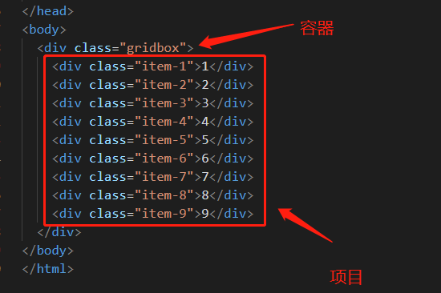
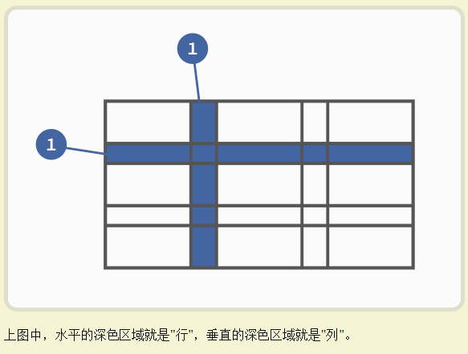

## grid 

1.  网格布局
2. 容器和项目
   1. 容器（最外包裹的是容器）
   2. 项目（内包裹的是项目）



3. ​	行与列

   1. 容器里面的水平区域称为"行"（row），垂直区域称为"列"（column）。

      

   ## 容器属性

   1. display 属性

      1. `display: grid`指定一个容器采用网格布局。
      2. 默认情况下，容器元素都是块级元素，但也可以设成行内元素
         * 注意，设为网格布局以后，容器子元素（项目）的`float`、`display: inline-block`、`display: table-cell`、`vertical-align`和`column-*`等设置都将失效。

   2. grid-template-columns / grid-template-rows

      1. grid-template-rows 行  定义每一行的行高
      2. grid-template-columns 列 定义每一列的列宽

   3.  单位可以使用 px | %

   4.  repeat()

      1.  当重复性高时推荐使用 repeat() 函数，简化重复值

      2. `repeat()`接受两个参数，第一个参数是重复的次数（上例是3），第二个参数是所要重复的值。

         `repeat()`重复某种模式也是可以的。

      3. auto-fill 关键字

         1. 有时，单元格的大小是固定的，但是容器的大小不确定。如果希望每一行（或每一列）容纳尽可能多的单元格，这时可以使用`auto-fill`关键字表示自动填充。

         ```html
         grid-template-columns: repeat(auto-fill, 100px);
         ```

      4. fr 关键字

         1. 为了方便表示比例关系，网格布局提供了`fr`关键字（fraction 的缩写，意为"片段"）。如果两列的宽度分别为`1fr`和`2fr`，就表示后者是前者的两倍。

         ```
         grid-template-columns: 1fr 1fr;
         ```

         2. `fr`可以与绝对长度的单位结合使用，这时会非常方便。

            > ```
            >  grid-template-columns: 150px 1fr 2fr;
            > ```

      ​          3.

   5. minmax()

      1. `minmax `函数产生一个大小范围，分别最大值最小值

      ```
      grid-template-columns: 1fr 1fr minmax(100px, 1fr);
      ```

      

   6. auto 关键字

      1. 由浏览器决定长度

      ```
      grid-template-columns: 100px auto 100px;
      ```

   7.  网格线名称

      1. `grid-template-columns`属性和`grid-template-rows`属性里面，还可以使用方括号，指定每一根网格线的名字，方便以后的引用。
      2. c 代表行 r 代表列

      ```
       grid-template-columns: [c1] 100px [c2] 100px [c3] auto [c4];
        grid-template-rows: [r1] 100px [r2] 100px [r3] auto [r4]
      ```

      3.  网格布局允许同一根线有多个名称

### 行与列间隔

 1. grid-row-gap （行间距）

 2. grid-column-gap （列间距）

 3. grid-gap (行与列合并简写)  `grid-gap`属性是`grid-column-gap`和`grid-row-gap`的合并简写形式，语法如下。

 4. 最新标准 `grid-` 前缀已经删除

 5. grid-template-areas （合并单元格）

     1. 在对应盒子上命名再使用 grid-template-areas 合并

     2. 如果某些地方不需要利用 用 · 表示

     3. ```css
        grid-template-areas: 'a . c'
                             'd . f'
                             'g . i';
        ```

```
.item-1 {
      grid-area: a;
      background-color: #ef342a;
    }

    .item-2 {
      grid-area: a;
      background-color: #f68f26;
    }
grid-template-areas: 
            "a a a"
            "b c c"
            "b c c";
```

6.  grid-auto-flow (摆放顺序)

   1. 默认顺序 先行后列

      | grid-auto-flow |                                                              |
      | -------------- | ------------------------------------------------------------ |
      | row            | 默认值 (先行后列)                                            |
      | column         | 先列后行                                                     |
      | row dense      | 某些项目指定位置后，剩下的项目怎么自动放置，表示"先行后列"，并且尽可能紧密填满，尽量不出现空格。 |
      | column dense   | 某些项目指定位置后，剩下的项目怎么自动放置，表示"先列后行"，并且尽量填满空格。 |

7.  justify-items（设置单元格水平位置（左中右））

8. align-items（设置单元格垂直位置（上中下））

9. place-items （`place-items`属性是`align-items`属性和`justify-items`属性的合并简写形式。）

| justify-items | start \| end \| center \| stretch; |
| ------------- | ---------------------------------- |
| align-items   | start \| end \| center \| stretch; |

* start：对齐单元格的起始边缘。
* end：对齐单元格的结束边缘。
* center：单元格内部居中。
* stretch：拉伸，占满单元格的整个宽度（默认值）。


 	10.	 justify-content (整个内容区域在容器里边的水平位置（左中右）)
 	11.	 align-content（整个内容区域的垂直位置（上中下））
 	12.	 place-content  （`place-content`属性是`align-content`属性和`justify-content`属性的合并简写形式。）

| justify-content | start \| end \| center \| stretch \| space-around \| space-between \| space-evenly; |
| --------------- | ------------------------------------------------------------ |
| align-content   | start \| end \| center \| stretch \| space-around \| space-between \| space-evenly; |

* start - 对齐容器的起始边框。
* end - 对齐容器的结束边框。
* center - 容器内部居中。
* stretch - 项目大小没有指定时，拉伸占据整个网格容器。
* space-around - 每个项目两侧的间隔相等。所以，项目之间的间隔比项目与容器边框的间隔大一倍。
* space-between - 项目与项目的间隔相等，项目与容器边框之间没有间隔。
* space-evenly - 项目与项目的间隔相等，项目与容器边框之间也是同样长度的间隔。


14. grid-auto-columns
15. grid-auto-rows

| grid-auto-columns | `grid-auto-columns`属性用来设置，浏览器自动创建的多余网格的列宽和行高。它们的写法与 |
| ----------------- | ------------------------------------------------------------ |
| grid-auto-rows    | `grid-auto-rows`属性用来设置，浏览器自动创建的多余网格的列宽和行高。它们的写法与 |

16. grid-template  | grid

    1. `grid-template`属性是`grid-template-columns`、`grid-template-rows`和`grid-template-areas`这三个属性的合并简写形式。

       `grid`属性是`grid-template-rows`、`grid-template-columns`、`grid-template-areas`、 `grid-auto-rows`、`grid-auto-columns`、`grid-auto-flow`这六个属性的合并简写形式。

## 项目属性

1. 

- `grid-column-start`属性：左边框所在的垂直网格线
- `grid-column-end`属性：右边框所在的垂直网格线
- `grid-row-start`属性：上边框所在的水平网格线
- `grid-row-end`属性：下边框所在的水平网格线

```
.item-1 {
  grid-column-start: 2;
  grid-column-end: 4;
}
```

* 上面代码指定，1号项目的左边框是第二根垂直网格线，右边框是第四根垂直网格线。
* 如果没有指定位置，其他项目都没有指定位置，由浏览器自动布局，这时它们的位置由容器的`grid-auto-flow`属性决定，这个属性的默认值是`row`，因此会"先行后列"进行排列。

