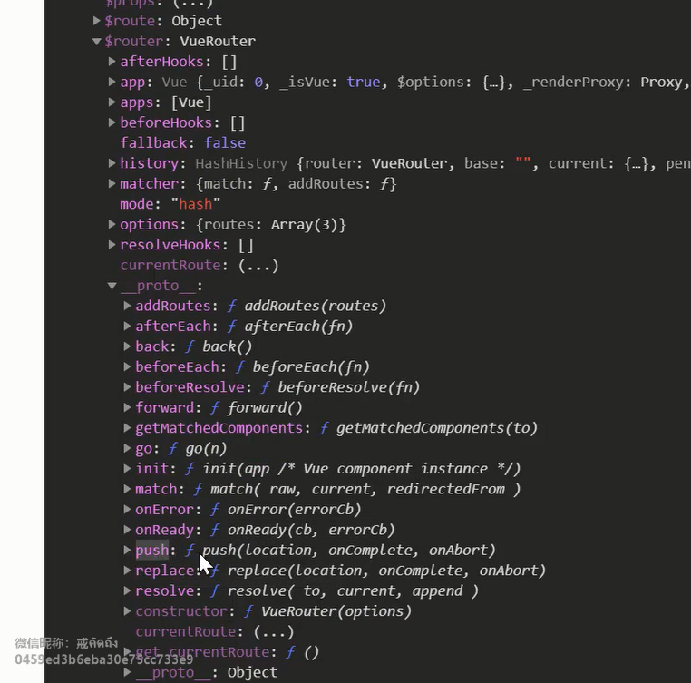
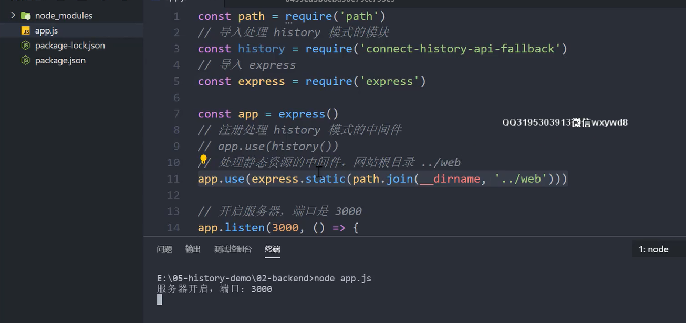
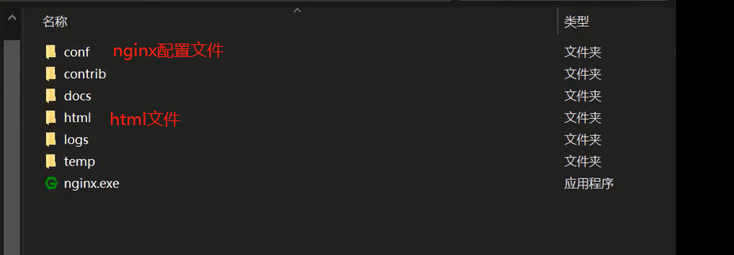
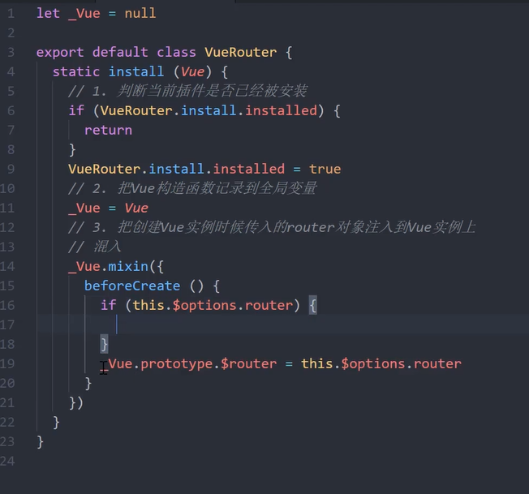
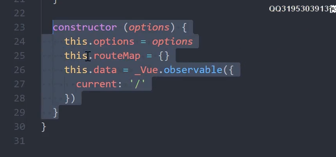

# Vue-Router 原理实现

* Vue Router 基础回顾
* Hash 模式和 History 模式
* 模拟实现自己的Vue Router

## vue-Router 基础使用

```
import VueRouter from 'vue-router'
// 1.注册路由插件
// 		Vue.use 是用来注册插件，他会调用传入对象的 install 方法
Vue.use(VueRouter)
// 路由规则
const routes = [
	{
		path: '/',
		name: 'index',
		component: Index
	}
]
main.js 文件

导入创建好的router页面
import routr from './router'

new Vue({
	3. 注册 router 对象
	router
})

4. 创建路由组件的占位
<router-view/>

5. 创建链接 
<router-link to='/'>Index</rouetr-link>
	
```

* $route 路由规则，当前路由的数据
* $router 路由对象 提供路由相关的方法
  * mode  **路由对应模式**
  * currentRoute **路由规则**
    * 当获取不到$route的时候可以通过$router中的currentRoute获取当前路由规则



### 动态路由传参

```
{
   path: '/detail/:id', // :id 占位符，通过占位来匹配我们变化的位置
   name: 'Detail',
   // 开启props,会把URl 中的参数传递给组件
   // 在组件中通过 props 来接受 URl 参数
   props: true,
   // route level code-splitting
   // this generates aseparate chunk (about.[hash].js) for this route
   // which is lazy-loaded when the route is visited.
   conponent: () => import(/* webpackChunkName: "detail" */ '../views/Detail.vue')
}
```

* 通过当前路由规则，获取数据

  ```js
  通过当前路由规则获取： {{ $route.params.id }}
  ```

* 路由规则中开启 props 传参

  ```js
  通过开启 props 获取: {{ id }}
  
  export defalt {
      name: 'Detail',
      props: ['id']
  }
  ```

  ### 嵌套路由

```
// 嵌套路由
{
  path:'/', // 会合并外部路由和内部路由，再去加载公共组件
  component: Layout,
  children: [
  	{
  	  name: 'index',
  	  path: '', // 可以是相对路径，也可以是绝对路径
  	  component: Index
  	},
  	{
  	  name: 'detail',
  	  path: 'detail/:id',
  	  props: true,
  	  component: () => import('@/views/Detail.vue')
  	}
  ]
}
```

### 编程式导航

```
.push
.replice
.go
```

* 长按返回可以调出浏览器历史记录

### Hash 和 HIstory 模式区别

#### 	表现形式区别：

* Hash 模式

  * https://www.baidu.com/#/one?id=123456

* HIstory 模式

  * https://www.baidu.com/one/123456

  #### 原理的区别

* Hash 模式是基于锚点，以及 onhashchange 事件

* History 模式是基于 HTML5 中的 History API

  * history.pushState()	IE 10以后才支持
  * history.replaceState()

### History 模式

* History 需要服务器的支持
* 单页应用中，服务端不存在 http://www.testurl.com/login这样的地址会返回找不到该页面
* 在服务端应该除了静态资源外都返回单页应用的index.html

==注意==

* 默认是 Hash 模式 如果需要更改需手动完成

```
const router = new VueRouter({
	mode: 'history',
	routes
})
```

### Node环境下服务器搭建



### nginx 服务器配置

* 从官网下载 nginx 的压缩包
* 把压缩包解压到C盘根目录，c:\nginx-1.18.0文件夹 (不能是中文)
* 打开命令行，切换到目录 c:\nginx-1.18.0

```js
# 启动
start nginx
# 重启
nginx -s reload
# 停止
nginx -s stop
```



==注意==

* 启动不会报错
* 如果端口被占用并不会报错
* 修改完配置文件后需要重启

```
在 ngins.conf 文件中
location / {
	root html;
	index index.html index.htm;
	try_files $url $url/ /index.html 
}
```

### Vue Router 实现原理

#### Vue 前置知识

* 插件
* 混入
* Vue.observable()
* 插槽
* render 函数
* 运行时和完整版的 Vue

#### Hash 模式

* URL 中 #后面的内容作为路径地址
* 监听 hashchange 事件
* 根据当前路由地址找到对应组件中心渲染

#### History 模式

* 通过 history.pushState() 方法改变地址栏
* 监听 popstate 事件
* 根据当前路由地址找到对应组件重新渲染

### Vue Router (install)

```javascript
const router = new VueRouter({
	mode: 'history', // 路由模式
	base: process.env.BASE_URl, // 路由基地址
	routes
})
```



* 构造函数



* createRouteMap()

功能：就是把Constructor(Options) 的路由规则 转换成键值对的形式传到routeMap 里边 routerMap的健就是路由地址，值就是就是这个地址所对应的组件

```
createRouteMap () {
	// 遍历所有的路由规则，把路由规则解析成键值对的形式 存储到routeMap中
	this.options.routes.forEach(route => {
		this.routeMap[route.path] = route.component
	})
}
```

router link

```
initComponents(Vue) {
	Vue.component('router-link', {
		props: {
		  to:string
		},
		template: '<a href="to"><slot></slot></a>
	})
}
```

Vue 的构建版本

运行时版：不支持 template 模板，需要打包的时候提前编译

完整版：包含运行时和编译器，体积比运行时版大10k左右，程序运行的时候把模板转换成 render 函数

### 使用完整版

### render

```
initComponents(Vue) {
	Vue.component('router-link', {
		props: {
		  to:string
		},
	//	template: '<a href="to"><slot></slot></a>
	render(h){
		return h('a', {
            attrs: {
				href: this.to
            },
            on: {
            	click: this.clickHandler
            }
		},[this.$slots.default])
	},
	methods: {
		clickHandler (e) {
			history.pushState({}, '', this.to)
			this.$router.data.current = this.to
			e.preventDefault()
		}
	}
	})
}
```

### router-view

```javascript
const self = this
Vue.component('router-view', {
	render(h){
		const component = self.routeMap[self.data.current]
		return h(component)
	}
})
```

### initEvent

```
initEvent () {
	window.addEventListener('popstate', ()=>{
		this.data.current = window.location.pathname
	})
}
```

## Vue 源码解析-响应式原理

### 课程目标

* Vue.js 的静态成员和实例成员初始化过程
* 首次渲染的过程
* **数据响应式原理**

### 准备工作

* Vue 源码的获取
  * 项目地址： https://github.com/vuejs/vue
  * fork 一份到自己仓库，克隆到本地，可以自己写注释提交到github
  * 为什么自己分析Vue 2.6
    * 新版本发布后，现有项目不会升级到3.0 2.x还有很长的一段过度期
    * 3.0 项目地址： https://github.com/vuejs/vue-next
* 源码目录结构

* src
  * compiler	编译相关
  * core    Vue核心库
  * platforms  平台相关代码
  * server    ssr  服务端渲染
  * sfc        .vue文件编译为js对象
  * shared     公共的代码

### 了解Flow

* 官网：https://flow.org/

* javascript 的**静态类型检查器**

* Flow的静态类型检查错误是通过静态类型推断实现的

  * 文件开头通过 // @flow 或者 /* @flow */ 声明

  ```
  /* @flow */
  function square(n: number): number {
  	return n * n;
  }
  square('2'); // Error!
  ```

  

