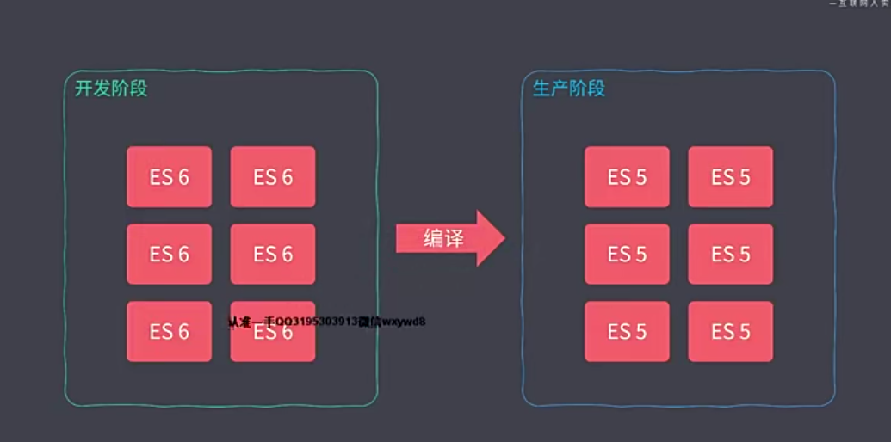
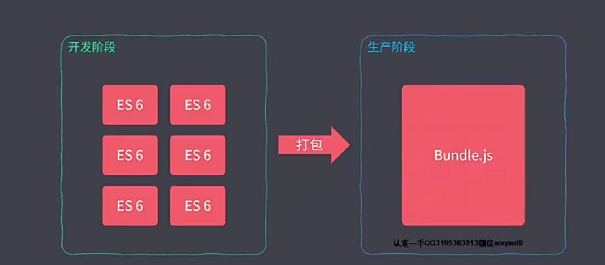

# npm 安装时 --save --dev 和 --save 区别

## 一、模式

运行webpack命令时，一定要指定模式。

webpack --mode development
webpack --mode production

## 二、--save -dev

--save：将保存配置信息到pacjage.json。默认为dependencies节点中。

--dev：将保存配置信息devDependencies节点中。

* 因此：

--save：将保存配置信息到pacjage.json的dependencies节点中。

--save-dev：将保存配置信息到pacjage.json的devDependencies节点中。

dependencies：运行时的依赖，发布后，即生产环境下还需要用的模块

devDependencies：开发时的依赖。里面的模块是开发时用的，发布时用不到它。

# 前端工程化

全副武装：通过工程化提升 战斗力

* 刀耕火种 的时代


## 内容概要

* 脚手架工具开发
* 自动化构建系统
* 模块化打包
* 项目代码规范化
* 自动化部署

# 脚手架工具开发

## 脚手架的本质作用

* 创建项目基础结构、提供项目规范和约定


* 相同的组织结构
* 相同的模块依赖
* 相同的工具配置
* 相同的基础代码

# Yeoman 

## 基本使用

* 全局范围安装 yo

```js
npm install yo --global #or yarn global add yo 
```

* 安装对应的 **generator**

```js
npm install generator-node --global # or yarn global add generator-node
```

* 通过 **yo** 运行 **generator**

```
cd path/to/projec-dir
mkdir my-module
yo node
```

## 常规使用说明

1.  新建项目

   1. ```js
      mkdir generator-ztp
      ```

2. 项目初始化

   1. ```js
      npm init // 项目初始化
      ```

       

3. 安装所需npm包

   1. ```js
      yarn add yeoman-generator@4.0.1  // yarn 安装对应版本
      ```

4. 新建文件

   1. 根目录下新建  generator/app/index.js
   2. app下新建文件夹 templates

5. 根据功能分为

   1. 往项目目录中写入文件

   2. 通过模板方式写入文件到目标目录

      1. 单文件

         1. ```js
            // 通过文件路径
                const tmpl = this.templatePath('ceshi.html')
                // 输出目标路径
                const output = this.destinationPath('ceshi.html')
                // 模板数据上下文
                const context = this.answers
            
                this.fs.copyTpl(tmpl,output,context)
            
            ```

      2. 多文件

         1. ```js
            // 多文件通过 forEach 遍历 写入
            ```

   3. 可以交互

      1. ```js
         prompting () {
              return this.prompt([
                {
                  type: 'input',
                  name: 'name',
                  message: '你的项目名称',
                  default: this.appname //appname  为项目生成目录名称
                }
              ])
              .then(answers =>{
                // answers => {name: 'user input value' }
                this.answers = answers
              })
            }
         ```

## npm 发包

* yarn publish || npm publish


# 自动化构建

# Grunt

## 基本使用

```js
npm init
code gruntfile.js // 新建文件

module.exports = grunt => {
  grunt.registerTask('foo', ()=>{
    console.log('hello grunt~')
  })

  grunt.registerTask('bar', '任务描述', ()=>{  // 第二个参数 是任务描述
    console.log('other task~')
  })

  // 如果任务名称为 default 的话 那么会成为默认任务

  // grunt.registerTask('default', ()=>{
  //   console.log('default task~')
  // })

  // 如果第二个参数为数组 会依次默认执行
  grunt.registerTask('default', ['foo','bar'])

  // grunt.registerTask('async-task', () => {
  //   setTimeout(() => {
  //     console.log('async task wording~')
  //   }, 1000);
  // })

  grunt.registerTask('async-task', function(){
    const done = this.async()
    setTimeout(() => {
      console.log('async task woring~')
      done()
    }, 1000);
  })
}
```

## grunt 标记失败任务

* 同步任务： return false
* 异步任务：  done(false)

## grunt 配置选项方法

* 根据 grunt提供的**initConfig**  进行配置信息
* 再用 config 获取相对应的值


## grunt 多目标任务

```js

// // 多目标任务

module.exports = grunt =>{
  grunt.initConfig({
    build: {
      css: {
        options:{
          foo: 'baz'
        }
      },
      js: '2'
    }
  })

  // 多目标模式，可以让任务根据配置形成多个自认为
  grunt.registerMultiTask('build', function () {
    console.log(this.options())
    console.log(`target: ${this.target}, data: ${this.data}`)
  })
}
```


## grunt 插件使用

```js
// 插件使用
module.exports = grunt => {
  grunt.initConfig({ // 配置目标
    clean:{ 
      temp: 'temp/**' // temp 目标需要清除的路径 * 通配符 ** 表示temp文件所有的文件，包括本身
    }
  })

  grunt.loadNpmTasks('grunt-contrib-clean')
}
```

## grunt 实现常用的构建任务

```js
// 实现常用的构建任务
// const sass = require('sass')
const sass = require('node-sass');
const loadGruntTasks = require('load-grunt-tasks')

module.exports = grunt => {
  grunt.initConfig({
    babel: {
      options: {
        sourceMap: true,
        presets: ['@babel/preset-env']
      },
      dist: {
        files: {
          'dist/js/app.js': 'src/js/app.js'
        }
      }
    },
    sass: {
      options: {
        sourceMap: true,
        implementation: sass
      },
      dist: {
        files:{
          'dist/css/main.css': 'src/scss/main.scss'
        }
      }
    },
    watch: {
      js: {
        files: ['src/js/*.js'],
        tasks: ['babel']
      },
      css: {
        files: ['src/scss/*.scss'],
        tasks: ['sass']
      }
    }
  })

  // grunt.loadNpmTasks('grunt-sass')
  loadGruntTasks(grunt) // 自动加载所有的 grunt 插件中的任务

  grunt.registerTask('default', ['sass', 'babel', 'watch'])
}
```

# Gulp 

## 基本使用

### 特点：

* 高效
* 易用

## 组合使用

```js

// grup 的组合使用

const {parallel, series} = require('gulp')

const task1 = done => {
  setTimeout(() =>{
    console.log('task1 working~')
    done()
  },1000)
}

const task2 = done => {
  setTimeout(() =>{
    console.log('task2 working~')
    done()
  },1000)
}

const task3 = done => {
  setTimeout(() =>{
    console.log('task3 working~')
    done()
  },1000)
}

exports.foo = series(task1,task2,task3)

exports.bar = parallel(task1,task2,task3)
```

## 异步的三种方式

```js
// gulp 异步的三种方式

exports.callback = done => {
  console.log('callback task~')
  done()
}

exports.callback_error = done => {
  console.log('coback task~')
  done(new Error('task failed'))
}

exports.promise = () => {
  console.log('promise task~')
  return Promise.resolve()
}

exports.promise_error = () => {
  console.log('promise task~')
  return Promise.resolve(new Error('task failed·~'))
}
const fs = require('fs');
const timeout = time => {
  return new Promise(resolve => {
    setTimeout(resolve,time)
  })
}

exports.async = async () => {
  await timeout(1000)
  console.log('async task~')
}

// exports.seream = () => {
//   const readStream = fs.createReadStream('package.json')
//   const writeStream = fs.createWriteStream('temp.txt')
//   readStream.pipe(writeStream)
//   return readStream
// }

exports.seream = done => {
  const readStream = fs.createReadStream('package.json')
  const writeStream = fs.createWriteStream('temp.txt')
  readStream.pipe(writeStream)
  readStream.on('end', () => {
    done()
  })
}
```

## gulp 构建过程核心原理

* 读取流
* 编辑流
* 写入流

## gulp 文件操作API + 插件的使用

```js
const { src, dest } = require('gulp')
const cleanCss = require('gulp-clean-css')
const rename = require('gulp-rename')
exports.default = () => {
  return src('*.css').pipe(cleanCss()).pipe(rename({ extname: '.min.css' })).pipe(dest('dist'))
}
```

## glup 文件编译案例

1.  克隆 https://github.com/zce/zce-gulp-demo
2. 运行 yarn 环境

## 封装自动化构建工作流

* 复用 gulp 问题
* 

# 前端模块化

* 模块化演变过程
* 模块化规范
* 常用的模块化打包工具
* 基于模块化工具构建现代Web应用
* 打包工具的优化技巧

## 模块化演变过程

1. 文件划分
   1. 污染全局作用域
   2. 命名冲突
   3. 无法管理模块依赖
2. 命名空间方式
   1. 没有私有空间
   2. 模块依赖问题
3. IIFE

## 模块化规范

### CommonJS规范

1. 一个文件就是一个模块
2. 每个模块都有单独的作用域
3. 通过 module.exports 导出成员
4. 通过 require 函数载入模块


* CommonJS 以同步模式加载模块

### AMD (Asynchronous Module Definition)

* 异步模式
* Require.js 库
* 目前绝大多数第三方库都支持
  * AMD使用起来相对复杂
  * 模块JS文件请求频繁

### Sea.js + CMD

## 模块化标准规范

* 模块化的最佳实践

浏览器使用 ES Modules

node.js 使用 CommonJS

## ES Modules

### 特性

* 自动采用严格模式，忽略'use strict'
* 每个ESM 模块都是单独的私有作用域
* ESM 是通过 CORS 去请求外部 JS 模块的
* ESM 的 script 标签会延迟执行脚本

### 导出和导入


### es 和 cjs 交互

* ES Modules 中可以导入 CommonJS 模块
* CommonJS 中不能导入ES Modules 模块
* CommonJS 始终只会导出一个默认成员
* 注意 import 不是结构导出对象

### es 和 cjs 差异 

### Babel兼容

# webpack 打包

* esm 兼容问题
* 模块文件过多，网络请求频繁

所有的前端资源都需要模块化

毋庸置疑，模块化是必要的





* 新特性代码编译
* 模块化 JavaScript 打包
* 支持不同类型的资源模块

##  模块化打包工具

**Webpack**

* 模块打包器
* 模块加载器 
* 代码拆分（Code Splitting）

资源模块 (Asset Module)

* 打包工具解决的是前端整体的模块化，并不单只js模块化

## webpack 快速上手 

1. 初始化项目

   1. ```js
      yarn init --yes // 初始化一个package.json
      
      yarn add webpack webpack-cli --dev // 安装webpack环境 
      
      yarn webpack --version // 查看webpack 版本
      
      yarn webpack  // 打包命令
      
      // 打包完成后会自动生成dist文件夹
      ```

      

## webpack 配置文件

## webpack 工作模式 

## webpack 打包原理 

## webpack 资源模块加载

loader 是webpack资源模块的核心，通过loader可以加载webpack所需要的资源

## webpack 导入资源模块

* js 驱动整个前端应用

新事物的思想：为什么这么设计

## webpack 文件资源加载器

