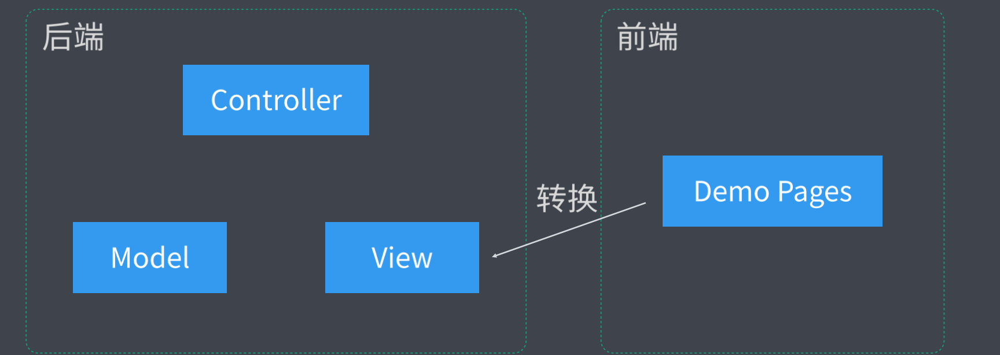
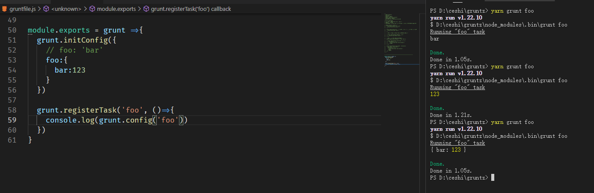

# 前端工程化

全副武装：通过工程化提升 战斗力

* 刀耕火种 的时代



## 内容概要

* 脚手架工具开发
* 自动化构建系统
* 模块化打包
* 项目代码规范化
* 自动化部署

# 脚手架工具开发

## 脚手架的本质作用

* 创建项目基础结构、提供项目规范和约定


* 相同的组织结构
* 相同的模块依赖
* 相同的工具配置
* 相同的基础代码

# Yeoman 

## 基本使用

* 全局范围安装 yo

```js
npm install yo --global #or yarn global add yo 
```

* 安装对应的 **generator**

```js
npm install generator-node --global # or yarn global add generator-node
```

* 通过 **yo** 运行 **generator**

```
cd path/to/projec-dir
mkdir my-module
yo node
```

## 常规使用说明

1.  新建项目

   1. ```js
      mkdir generator-ztp
      ```

2. 项目初始化

   1. ```js
      npm init // 项目初始化
      ```

       

3. 安装所需npm包

   1. ```js
      yarn add yeoman-generator@4.0.1  // yarn 安装对应版本
      ```

4. 新建文件

   1. 根目录下新建  generator/app/index.js
   2. app下新建文件夹 templates

5. 根据功能分为

   1. 往项目目录中写入文件

   2. 通过模板方式写入文件到目标目录

      1. 单文件

         1. ```js
            // 通过文件路径
                const tmpl = this.templatePath('ceshi.html')
                // 输出目标路径
                const output = this.destinationPath('ceshi.html')
                // 模板数据上下文
                const context = this.answers
            
                this.fs.copyTpl(tmpl,output,context)
            
            ```

      2. 多文件

         1. ```js
            // 多文件通过 forEach 遍历 写入
            ```

   3. 可以交互

      1. ```js
         prompting () {
              return this.prompt([
                {
                  type: 'input',
                  name: 'name',
                  message: '你的项目名称',
                  default: this.appname //appname  为项目生成目录名称
                }
              ])
              .then(answers =>{
                // answers => {name: 'user input value' }
                this.answers = answers
              })
            }
         ```

## npm 发包

* yarn publish || npm publish


# 自动化构建

# Grunt

## 基本使用

```js
npm init
code gruntfile.js // 新建文件

module.exports = grunt => {
  grunt.registerTask('foo', ()=>{
    console.log('hello grunt~')
  })

  grunt.registerTask('bar', '任务描述', ()=>{  // 第二个参数 是任务描述
    console.log('other task~')
  })

  // 如果任务名称为 default 的话 那么会成为默认任务

  // grunt.registerTask('default', ()=>{
  //   console.log('default task~')
  // })

  // 如果第二个参数为数组 会依次默认执行
  grunt.registerTask('default', ['foo','bar'])

  // grunt.registerTask('async-task', () => {
  //   setTimeout(() => {
  //     console.log('async task wording~')
  //   }, 1000);
  // })

  grunt.registerTask('async-task', function(){
    const done = this.async()
    setTimeout(() => {
      console.log('async task woring~')
      done()
    }, 1000);
  })
}
```

## grunt 标记失败任务

* 同步任务： return false
* 异步任务：  done(false)

## grunt 配置选项方法

* 根据 grunt提供的**initConfig**  进行配置信息
* 再用 config 获取相对应的值



## grunt 多目标任务

