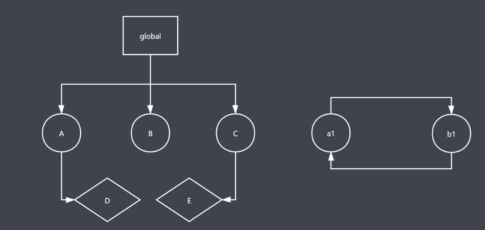
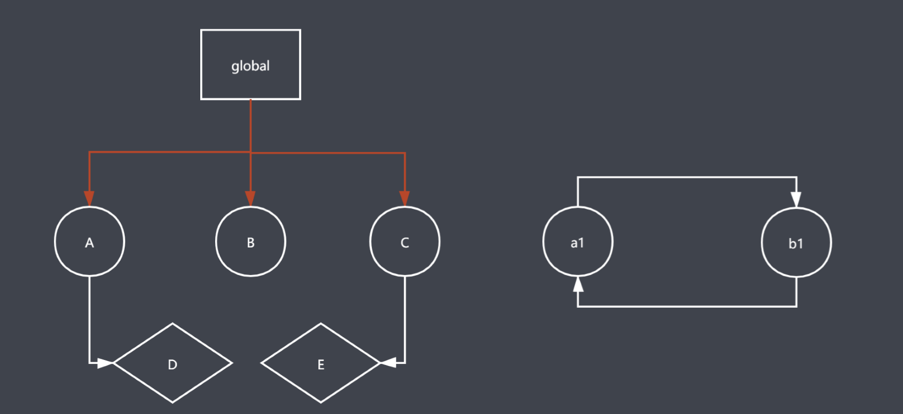
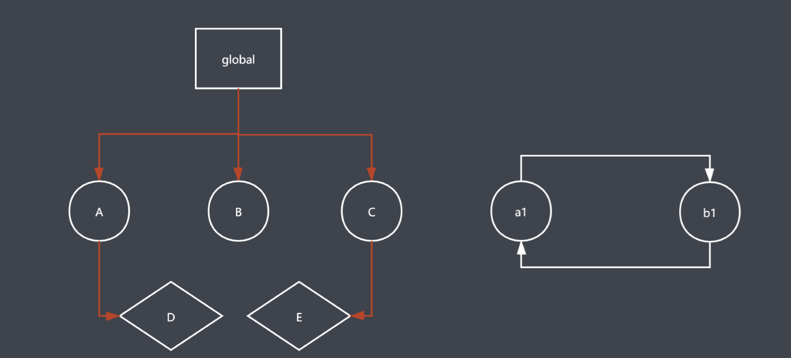
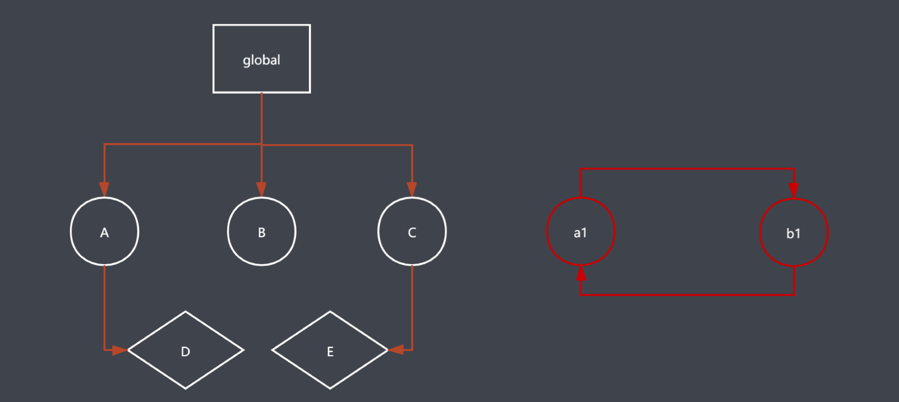
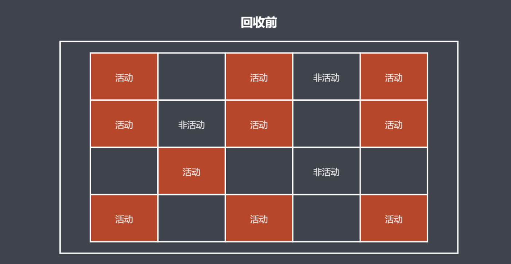
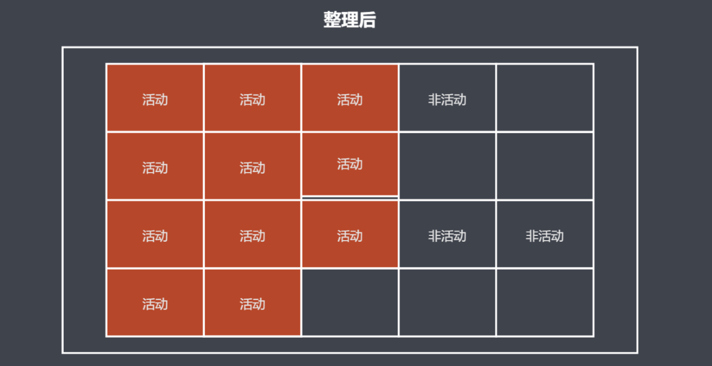
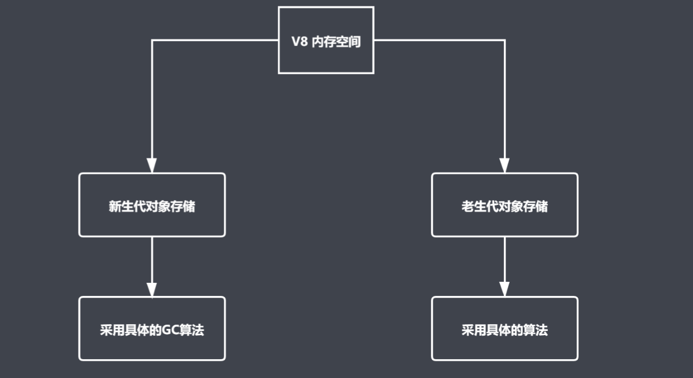
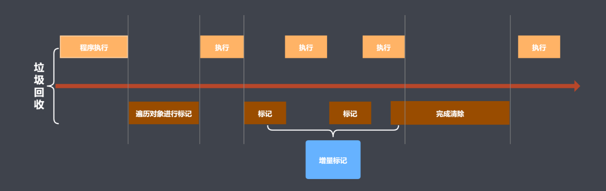

## 引用计数算法优缺点

优点

* 发现垃圾时立即回收 
* 最大限度减少程序暂停

缺点

* 无法回收循环引用对象
* 时间开销大

## 标记清楚算法

* 核心思想：分标记和清除二个阶段完成
* 遍历所有对象找标记活动对象
* 遍历所有对象清楚没有标记对象
* 回收相应的空间

## 标记清楚算法优缺点

## 标记整理算法实现原理

* 标记整理可以看作是标记清除的增强
* 标记阶段的操作和标记清除一致
* 清楚阶段会先执行整理，移动对象位置

## 标记整理算法图示

## 常见GC 算法

* 引用计数 （优缺点）
  * 可以即时回收垃圾对象
  * 减少程序卡顿时间
  * 无法回收循环引用的对象
  * 资源消耗较大
* 标记清除
  * 可以回收循环引用的对象
  * 容易产生碎片化空间，浪费时间
  * 不会立即回收垃圾对象
* 标记整理
  * 减少碎片化空间
  * 不会立即回收垃圾对象
  * 移动对象位置，回收效率慢

# v8

## 介绍

* V8 是一款主流的Javascript 执行引擎
* V8 采用即使编译
* V8 内存设限

## V8 垃圾回收策略

* 采用分代回收的思想
* 内存分为新生代、老生代
* 针对不同对象采用不同算法

### V8 中常用GC 算法

* 分代回收
* 空间复制
* 标记清除
* 标记整理
* 标记增量

## V8 如何回收新生代对象

### V8 内存分配

* V8 内存空间一分为二
* 小空间用于存储新生代对象 （32M | 16M)
* 新生代指的是存活时间较短的对象

### 新生代对象回收实现

* 回收过程采用复制算法 + 标记整理
* 新生代内存区分为二个等大小空间
* 使用空间为 From, 空闲空间为 To
* 活动对象存储于 From 空间
* 标记整理后将活动对象拷贝至 To
* From 与 To 交换空间完成释放

### 回收细节说明

* 拷贝过程中可能出现晋升
* 晋升就是将新生代对象移动至老生代
* 一轮 GC 还存货的新生代需要晋升
* To 空间的使用率超过 25%

## V8 如何回收老生代对象

### 老年代对象说明

* 老年代对象存放在右侧老生代区域
* 64位操作系统1.4G, 32 操作系统700M
* 老年带对象就是指存活时间较长的对象

### 老年代对象回收实现

* 主要采用标记清除、标记整理、增量标记算法
* 首先使用标记清除完成立即空间的回收
* 采用标记整理进行空间优化
* 采用增量标记进行效率优化

### 细节对比

* 新生代区域垃圾回收使用空间换时间
* 老生代区域垃圾回收不适合复制算法

### 标记增量如何优化垃圾回收

## V8 总结

* V8 是一款主流的 JavaScript 执行引擎
* V8 内存设置上限
* V8 采用基于分代回收思想实现垃圾回收
* V8 内存分为新生代和老生代
* V8 垃圾回收常见的算法

# performance 工具介绍

## 为什么使用performance

* GC的目的是为了实现内存空间的良性循环
* 良性循环的基石是合理使用
* 时刻关注才能确定是否合理
* performance提供多种监控方式

## 通过 performance 时刻监控内存

### performance 使用步骤

1. 打开浏览器输入目标地址
2. 进入开发人员工具面板，选择性能
3. 开启录制功能，访问具体界面
4. 执行用户行为，一段时间后停止录制
5. 分析界面中技术的内存信息

## 内存问题的体现

### 内存问题的外在表现

* 页面出现延迟加载或经常性暂停
* 页面持续性出现糟糕的性能
* 页面的性能随时间延长越来越差

## 监控内存的几种方式

### 界定内存问题的标准

* 内存泄漏：内存使用持续升高
* 内存膨胀： 在多数设备上都存在
* 频繁垃圾回收: 通过内存变化图进行分析

### 监控内存的几种方式

* 浏览器任务管理器
* Timeline 时序图记录
* 堆快照查找分离DOM
* 判断是否存在频繁的垃圾回收

## 全局变量缓存

* 将使用中无法避免的全局变量缓存到局部

## 通过原型新增方法

* 在原型对象上新增实例对象需要的方法

## 关于闭包

* 闭包是一种强大的语法
* 闭包使用不当很容易出现内存泄漏
* 不要为了闭包而闭包

## 避免属性访问方法使用

* JS 不需属性的访问方法，所有属性都是外部可见的
* 使用属性访问只会增加一层重定义，没有访问的控制力

