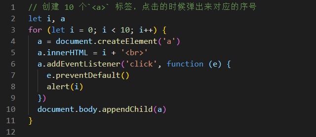
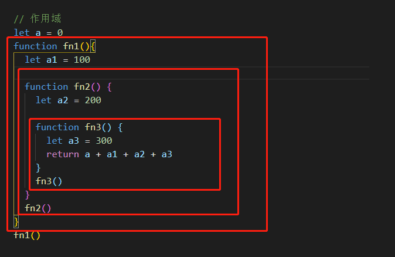

* typeof 能判断哪些类型？
  * 考点 JS 变量类型
* 何时使用=== 何时使用 ==
  * 考点：强制类型转换
* window.onload 和 DOMContentLoaded 的区别？
  * 考点：页面加载过程 

* JS 创建 10个 <a> 标签，点击的时候弹出对应的序号
  * 考点： JS作用域
* 手写节流 throttle、防抖 debounce 
  * 考点：性能、体验优化
* Promise 解决了什么问题？
  * 考点：JS 异步

# 思考

* 拿到一个面试题、你第一时间看到的是什么？-> **考点**
* 如何看待网上都出来的永远做不完的题海？-> **不变应万变（题可变，考点不变）**
* 如何对待接下来遇到的面试题？-> **题目到知识点、再到题目**

## 知识体系

* 高效学习三部曲：找准知识体系；刻意训练；及时反馈；
*  知识体系：结构化的知识范围
* 涵盖所有知识点；结构化、有组织、易扩展 

## 变量类型和计算

* 题目
* 知识点
* 解答

# 值类型和引用类型

## 小结

* 值类型 vs 引用类型、堆栈模型、深拷贝
* typeof 运算符
* 类型转换、tyuly 和 falsely 变量

## 题目

* typeof 能判断哪些类型
  * 识别所有值类型
  * 识别函数
  * 判断是否是引用类型（不可再细分）
* 何时使用 === 何时使用 ==
  * 除了 == null 之外，其余全部用 ===
* 值类型和引用类型的区别
  *  
* 手写深拷贝
  * 注意判断值类型和引用类型
  * 注意判断是数组还是对象
  * 递归

## 知识点

* 变量类型
  * 值类型 VS 引用类型
  * typeof 运算符
  * 深拷贝
* 变量计算

###  常见值类型

```javascript
const a // const 会报错 let undefined
const s = 'abc'
const n = 100
const b = true
const s = Symbol('s')
```

###  常见引用类型

```js
// 常见引用类型

const obj = { x: 100 }
const arr = ['a', 'b', 'c']

const n = null // 特殊引用类型，指针指向为空

// 特殊引用类型，但不用于存储数据，所以没有"拷贝、复制函数" 这一说法

function fn() {}
```

### typeof 运算符

* 识别所有值类型
* 识别函数
* 判断是否引用类型（不可再细分了）

```js
// 判断所有值类型
let a;                 typeof a // 'undefined'
const str = 'abc';     typeof str // 'string'
const n = 100;         typeof n // 'number'
const b = true;        typeof b // 'boolean'
const s = Symbol('s'); typeof s // 'symbol' 

// 能判断函数
typeof console.log // 'function'
typeof function () {} // 'function'

// 能识别引用类型 (不能再继续识别)
typeof null // 'object'
typeof ['a','b'] // 'object'
typeof { x: 100 } // 'object'
```

### 安装  

* 描述

  * 启动本地http服务器

* 安装命令

  * ```js
     npm install http-server -g
    ```

* 启动命令

  * ```
    http-server -p 8001
    ```

## 变量计算

### 类型转换

* 字符串拼接
* ==
* if 语句和逻辑运算

### 字符串拼接

```js
const a = 100 + 10 // 110
const b = 100 + '10' // '10010'
const c = true + '10' // 'true10'
```

### == 运算符

**注意：除了 == null 之外，其他都一律用 ===**

```js
100 == '100' // true
0 == '' // true
0 == false // true
false == '' // true
null == undefined // true

// 除了 == null 之外，其他都一律用 === ,  例如：

const obj = { x: 100 }
if(obj.a == null) {}

// 相当于：
// if (obj.a === null || obj.a === undefined) {}
```

### if 语句和逻辑运算

* truly 变量: !!a === true 的变量
* falsely 变量: !!a === false 的变量

```js
/**
 * if 语句和逻辑运算 
 */

// 以下是 falsely 变量。 初次之外都是 truly 变量
!!0 === false
!!NaN === false
!!'' === false
!!null === false
!!undefined === false
!!false === false

```

**逻辑运算**

```js
// 逻辑判断
console.log(10 && 0)  //0
console.log('' || 'abc')  // 'abc'
console.log(!window.abc)  // true
```

# 原型和原型链

* 题目
  * 如何准确判断一个变量是不是数组?
    *   instanceof Array
  * 手写一个简易的jQuery,考虑插件和扩展性
  * class 的原型本质，怎么理解？
    * 原型和原型链的图示
    * 属性和方法的执行规则
* 知识点
  * class 和 继承
  * 类型判断 instanceof
  * 原型和原型链
* 解答

## class和继承

* constructor
* 属性
* 方法

### 继承

* extends
* super
* 扩展或重写方法

## 原型

```js
// class 实际上是函数，可见是语法糖
typeof People // 'function'
typeof Student // 'function'

// 隐式原型和显示原型
console.log(xialuo.__proto__)
console.log(Student.prototype)
console.log(xialuo.__proto__ === Student.prototype)
```

### 原型关系

* 每个class 都有显示原型 prototype
* 每个实例都有隐式原型 proto
* 实例的 proto 指向对应 class 的 prototype

### 基于原型的执行规则

* 获取属性 xialuo.name 或执行方法 xialuo.sayhi() 时
* 先在自身属性和方法寻找
* 如果找不到则自动去 proto 中查找 

## 原型链

```js
console.log(Student.prototype.__proto__)
console.log(People.prototype)
console.log(People.prototype === Student.prototype.__proto__)

hasOwnProperty() // 是否包含属性 
```

##  重要提示！！！

* class 是 ES6 语法规范，由 ECMA 委员会发布
* ECMA 只规定语法规则，即我们代码的书写规范，不规定如何实现
* 以上实现方式 都是 V8 引擎的实现方式，也是主流的

# 作用域和闭包

* 题目

  * this 的不同应用场景，如何取值？
    * 当做普通函数被调用
    * 使用 call apply bind
    * 作为对象方法调用
    * 在 class 的方法中调用
    * 箭头函数
  * 手写 bind 函数
  * 实际开发中闭包的应用场景，举例说明
    * 隐藏数据
  * 如下图所示：

  

* 知识点

  * 作用域和自由变量
  * 闭包
  * this

## 作用域

* 全局作用域

* 函数作用域

* 块级作用域( ES6 新增 )

  * ```js
    // ES6 块级作用域
    if (true) {
    	let x = 100
    }
    console.log(x) // 会报错
    ```



## 自由变量

* 一个变量在当前作用域没有定义，但被使用了
* 向上级作用域，一层一层一次寻找，知到找到为止
* 如果到全局作用域都没找到，则报错 xx is no t defined

## 闭包

* 作用域应用的特殊情况，有两种表现：
  * 函数作为参数被传递
  * 函数是作为的返回值被返回

## this

* 作为普通函数
* 使用 call apply bind
  * call 调用就执行了
  * bind 会返回一个函数
* 作为对象方法被调用
* 在 class 方法中调用
* 箭头函数

注意：**this取什么样的值是在函数调用的时候确认的，而不是在定义的时候确认的** 

## 小结

* 作用域和自由变量
* 闭包：两种常见方式 & 自由变量查找规则
* this

# 同步和异步的区别

## 异步和单线程

* 题目

  * 同步和异步的区别是什么？

    * 基于JS 是单线程语言
    * 异步不会阻塞代码执行
    * 同步会阻塞代码执行

  * 手写用 Promise 加载一张图片

  * 前端使用异步的场景有哪些？

  * ```js
    // setTimeout 笔试题
    console.log(1)
    setTimeout(function () {
      console.log(2)
    }, 1000)
    console.log(3)
    setTimeout(function () {
      console.log(4)
    }, 0)
    console.log(5)
    ```

* 知识点

  * 单线程和异步
    * JS 是单线程语言，只能同时做一件事儿 
    * 浏览器和 nodejs 已支持 JS 启动 **进程**，如 Web whorker
    * JS 和 DOM 渲染共用同一个线程，因为 JS 可修改 DOM 结构
    * 遇到等待（网络请求，定时任务）不能卡住
    * 需要异步
    * 回调 callback 函数形式
  * 应用场景
  * callback hell 和 Promise

### 异步和同步

* 基于JS 是单线程语言
* 异步不会阻塞代码执行
* 同步会阻塞代码执行